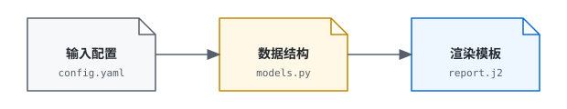

# jinja-build

## 演示



### models.py

```python
class Data:
    def __init__(self, name: str, enabled: bool = True):
        self.name = name
        self.enabled = enabled


class Models:
    def __init__(self, title: str, datas: list[Data], n: int):
        self.title = title
        self.datas = datas
        self.n = n

    @property
    def upper_title(self) -> str:
        # 将 title 转为大写
        return self.title.upper()

    def square(self, n: int) -> str:
        # 计算平方
        return str(n * n)
```

### report.txt.j2

```jinja
{{ upper_title }}


    
{{ data.name }}
    


{{ n }} * {{ n }} = {{ square(n) }}
```

### config.yaml

```yaml
title: hello
datas:
  - name: alpha
    enabled: true
  - name: beta
    enabled: false
  - name: gamma
    enabled: true
n: 5
```

### 生成结果

生成文件 `report.txt`

```text
HELLO

alpha
gamma

5 * 5 = 25
```

## 命令行参数

| 长参数 | 短参数 | 类型 | 必填 | 默认值 | 说明 |
| --- | --- | --- | --- | --- | --- |
| `--template` | `-t` | 目录 | ✓ | | 模板目录。 |
| `--output` | `-o` | 路径 | ✓ | | 渲染结果写出路径。 |
| `--input` | `-i` | 文件或目录路径 | | | 输入配置；传文件时单次构建，传目录时目录内每个文件各生成一个独立输出目录。 |
| `--models-filename` | `-mf` | 文件名 | | `models.py` | 模板目录中的数据结构文件名。 |
| `--debug-input` | | 路径 | | | 调试文件，输入配置解析后；目录输入时该路径作为目录，按输入文件名写出多个 JSON。 |
| `--debug-models` | | 路径 | | | 调试文件，数据结构渲染后；目录输入时该路径作为目录，按输入文件名写出多个 JSON。 |
| `--theme` | | `auto` / `light` / `dark` / `none` | | `auto` | 颜色主题。 |

## 使用

### 单个输入

```makefile
TOOL       := /path/to/tool                 # 可执行文件或脚本
TEMPLATE   := /path/to/templates/chip       # 模板族目录
OUTPUT     := /path/to/out/generated        # 渲染结果写出路径（文件或目录）
INPUT      := /path/to/in/chip.yaml         # 单次构建用的配置文件
# MODELS_FILENAME := custom_models.py       # 模板目录内非默认的数据结构文件名
# DEBUG_INPUT  := /path/to/out/input.json   # 对照配置解析中间结果
# DEBUG_MODELS := /path/to/out/models.json  # 对照 models 实例化中间结果
# THEME := dark                             # 终端错误提示配色

.PHONY: render
render:
	$(TOOL) -t $(TEMPLATE) -o $(OUTPUT) -i $(INPUT)
#	-mf $(MODELS_FILENAME) --debug-input $(DEBUG_INPUT) \
#	--debug-models $(DEBUG_MODELS) --theme $(THEME)
```

### 目录输入

目录内多份输入配置文件共用同一套模板，每个输入生成一个同名输出目录。

```makefile
TOOL       := /path/to/tool                 # 可执行文件或脚本
TEMPLATE   := /path/to/templates/chip       # 模板族目录
OUTPUT     := /path/to/out/generated        # 目录输入的输出根目录
INPUT      := /path/to/in/scenes            # 批量构建的配置文件目录
# MODELS_FILENAME := custom_models.py       # 模板目录内非默认的数据结构文件名
# DEBUG_INPUT  := /path/to/out/input-debug  # 对照配置解析中间结果目录
# DEBUG_MODELS := /path/to/out/models-debug # 对照 models 实例化中间结果目录
# THEME := dark                             # 终端错误提示配色

.PHONY: render
render:
	$(TOOL) -t $(TEMPLATE) -o $(OUTPUT) -i $(INPUT)
#	-mf $(MODELS_FILENAME) --debug-input $(DEBUG_INPUT) \
#	--debug-models $(DEBUG_MODELS) --theme $(THEME)
```

## 支持的第三方库

- rich
